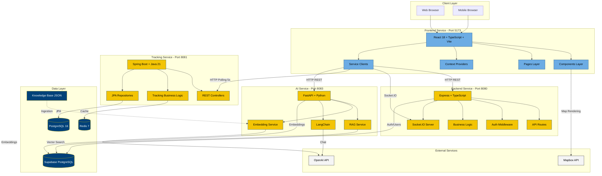

# Bantam Shuttle - Trinity College Shuttle Tracking Application

A modern, full-featured shuttle tracking application built for Trinity College with React 18, Vite, TypeScript, and Tailwind CSS. Built with a microservices architecture featuring React frontend, Node.js backend, Spring Boot tracking service, and Python AI service.

## Live Demo
Production Application: 
```bash
http://shuttle.javajon-gke.duckdns.org/
```
The application is deployed on Google Kubernetes Engine (GKE) and accessible via DuckDNS.

## Quick Start

## Option 1: Access the Deployed Application (Recommended)

Simply visit the live application:
```bash
http://shuttle.javajon-gke.duckdns.org/
```
All services are running on the Kubernetes cluster:

Frontend UI: Available at root path
Backend API: Internal service communication
Tracking Service: Internal service communication
AI Service: Internal service communication

Login Requirements:

Register with a @trincoll.edu email address
Verify your email to access the application

## Option 2: Local Development Setup 

Run the complete setup script to start all services:

```bash
./scripts/start-everything.sh
```

This will:
- Check prerequisites (Docker, Node.js, Python, Java)
- Set up Docker databases (PostgreSQL + Redis)
- Install all dependencies for all services
- Configure Python virtual environment for AI service
- Start all 4 microservices in separate terminals

Access the application:
- **Frontend**: http://localhost:5173
- **Backend API**: http://localhost:8080/api-docs
- **Tracking Service**: http://localhost:8081/swagger-ui.html
- **AI Service**: http://localhost:8083/docs

### Prerequisites

- **Docker Desktop** (for PostgreSQL + Redis)
- **Node.js** v24.10.0+ and npm
- **Python** 3.12.4+
- **Java** 21 (for tracking service)

## Table of Contents

- [Architecture](#architecture)
- [Features](#features)
- [Tech Stack](#tech-stack)
- [Manual Setup (Local Development)](#manual-setup-local-development)
- [Utility Scripts](#utility-scripts)
- [Testing](#testing)
- [Project Structure](#project-structure)
- [Color Palette](#color-palette-trinity-college-brand)
- [Map Features (LiveMap Component)](#map-features-livemap-component)
- [Tracking Service Integration](#tracking-service-integration)
- [Routes](#routes)
- [Authentication](#authentication)
- [API Integration](#api-integration)
- [Real-time Updates](#real-time-updates)
- [Environment Variables](#environment-variables)
- [Development Notes](#development-notes)
- [RabbitMQ Implementation](#rabbitmq-implementation)
- [Deployment](#deployment)
- [Getting Started with Tracking Service Integration](#getting-started-with-tracking-service-integration)
- [Deployments](#deployments)
- [AI Statement](#ai-statement)
- [Support](#support)
- [License](#license)

## Architecture

This is a microservices application with 4 main services:

1. **Frontend** (React + TypeScript + Vite) - Port 5173
2. **Backend** (Node.js + Express + TypeScript) - Port 8080
3. **Tracking Service** (Spring Boot + Java 21) - Port 8081
4. **AI Service** (Python + FastAPI + LangChain) - Port 8083

**Databases:**
- Supabase PostgreSQL (Backend + AI Service)
- Local PostgreSQL 16 (Tracking Service)
- Redis 7 (Tracking Service cache)

## Architecture Diagram


## Features

- **Student Portal**: Real-time shuttle tracking with interactive maps, route information, and stop details
  - Live bus markers on map with location polling (5-second intervals)
  - Bus stops (red S markers) fetched from tracking-service
  - Active bus markers (green B) showing real-time GPS from tracking-service
  - Request ride with start/end location selection
  - Currently, the UI is not rendering the stop and bus markers in the frontend due to some bug, however, they can be accessed in the database (in namespace elite-db).

- **Driver Dashboard**: Clock in/out functionality, status management, and live location tracking
  - View all campus stops on map
  - See all active buses with real-time positions
  - GPS location polling (5-second intervals)

- **Admin Dashboard**: Live view of all shuttles, routes, and analytics with charts
  - **Live Tab**: Real-time view of all buses and stops on interactive map
  - **Analytics Tab**: Peak usage charts, route popularity metrics
  - **Stops Management Tab**: Create, update, delete shuttle stops with map placement
  - Add stops by clicking on map and entering stop name
  - Delete stops with one-click removal
  - All stops persisted in tracking-service

- **AI Chatbot**: Floating action button chatbot for shuttle inquiries

- **Authentication**: Secure login/register with @trincoll.edu email validation

- **Responsive Design**: fully responsive web interface
- **Real-time Updates**: 
  - Socket.IO integration for live shuttle location updates
  - 5-second polling from tracking-service for bus locations (`/v1/locations/latest/org/trinity`)
  - Auto-loading of all campus stops from tracking-service (`/v1/stops`) {Not rendered as of now due to a frontend bug}

## Tech Stack

- **Frontend Framework**: React 18 with TypeScript
- **Build Tool**: Vite
- **Styling**: Tailwind CSS
- **Routing**: React Router DOM
- **State Management**: React Context API
- **API Client**: Axios with interceptors
- **Real-time Communication**: Socket.IO
- **Maps**: Mapbox GL
- **Charts**: Recharts
- **Testing**: Vitest + React Testing Library
- **Icons**: Lucide React

## Manual Setup (Local Development)

### 1. Environment Variables

Create `.env` files with your credentials:

**Root `.env`:**
```env
VITE_MAPBOX_TOKEN=your_mapbox_token
VITE_API_BASE_URL=http://localhost:8080/api
VITE_SOCKET_URL=http://localhost:8080
SUPABASE_URL=your_supabase_url
SUPABASE_ANON_KEY=your_supabase_anon_key
JWT_SECRET=your_jwt_secret
OPENAI_API_KEY=your_openai_key
```

**Frontend `.env`:**
```env
VITE_MAPBOX_TOKEN=your_mapbox_token
VITE_API_BASE_URL=http://localhost:8080/api
VITE_SOCKET_URL=http://localhost:8080
VITE_TRACKING_SERVICE_URL=http://localhost:8081
VITE_AI_SERVICE_URL=http://localhost:8083
```

**Backend `.env`:**
```env
PORT=8080
SUPABASE_URL=your_supabase_url
SUPABASE_ANON_KEY=your_supabase_anon_key
JWT_SECRET=your_jwt_secret
TRACKING_SERVICE_URL=http://localhost:8081
AI_SERVICE_URL=http://localhost:8083
```

**AI Service `.env`:**
```env
DATABASE_URL=your_supabase_connection_string
OPENAI_API_KEY=your_openai_key
EMBEDDING_MODEL=text-embedding-3-small
CHAT_MODEL=gpt-4o-mini
```

### 2. Database Setup

Start Docker databases:
```bash
./scripts/setup-databases.sh
```

Run Supabase migrations:
```bash
./scripts/setup-supabase.sh
```

### 3. Start Services

**Backend:**
```bash
cd backend && npm install && npm run dev
```

**Frontend:**
```bash
cd frontend && npm install && npm run dev
```

**Tracking Service:**
```bash
cd tracking-service && ./gradlew bootRun
```

**AI Service:**
```bash
cd AI_Intergration_Service
python -m venv .venv
source .venv/bin/activate  # On Windows: .venv\Scripts\activate
pip install -r requirements.txt
uvicorn app.main:app --reload --port 8083
```

## Utility Scripts

- **`./start-everything.sh`** - Complete automated setup and startup
- **`./stop-everything.sh`** - Stop all services and containers
- **`./run-tests.sh`** - Run comprehensive test suite (25 tests)
- **`./check-env.sh`** - Validate environment variables
- **`./setup-databases.sh`** - Set up Docker databases
- **`./setup-supabase.sh`** - Interactive Supabase migration guide

See `SCRIPTS_GUIDE.md` for detailed documentation.

## Testing

Run comprehensive test suite:
```bash
./scripts/run-tests.sh
```

Individual service tests:
```bash
# Frontend
cd frontend && npm run test
```bash
# Backend
cd backend && npm test

# Tracking Service
cd tracking-service && ./gradlew test

# AI Service
cd AI_Intergration_Service && source .venv/bin/activate && pytest
```

## Project Structure

```
Ctrl-Alt-Elite/
├── frontend/                    # React + TypeScript + Vite (Port 5173)
|   |__ kubernetes/
│   ├── src/
│   │   ├── components/          # Reusable React components
│   ├── Header.tsx       # Navigation header
│   ├── Sidebar.tsx      # Navigation sidebar
│   ├── LiveMap.tsx      # Mapbox integration with bus & stop markers
│   │                    # - Fetches real-time bus locations from tracking-service
│   │                    # - Displays stop markers (red S)
│   │                    # - Displays bus markers (green B) with live polling
│   │                    # - Supports route visualization with Mapbox layers
│   ├── RouteSidebar.tsx # Route selection interface
│   ├── Chatbot.tsx      # AI chatbot component
│   ├── ChatbotUI.tsx    # Chatbot UI wrapper
│   ├── ProtectedRoute.tsx # Route guard component
│   └── Global.tsx       # Global context provider
├── pages/              # Page components
│   ├── LoginPage.tsx   # Authentication
│   ├── RegisterPage.tsx # User registration
│   ├── VerifyEmailPage.tsx # Email verification
│   ├── StudentDashboard.tsx # Student view
│   │                       # - Fetches stops from tracking-service (/v1/stops)
│   │                       # - Polls buses from tracking-service (/v1/locations/latest/org/trinity)
│   │                       # - Updates map every 5 seconds with live bus positions
│   │                       # - Converts microdegrees to decimal for display
│   ├── DriverDashboard.tsx # Driver view
│   │                       # - Same stop loading from tracking-service
│   │                       # - Same bus polling mechanism (5-second intervals)
│   │                       # - Shows all campus stops and active buses
│   ├── AdminDashboard.tsx  # Admin view with three tabs
│   │                       # - Live Tab: Map with stops and buses
│   │                       # - Analytics Tab: Charts and metrics
│   │                       # - Stops Management Tab: CRUD operations for stops
│   │                       # - Can add stops by clicking map and entering name
│   │                       # - Can delete stops from list
│   │                       # - All changes persisted to tracking-service
│   ├── Placeholders.tsx # Placeholder pages
│   └── NotFound404.tsx  # 404 page
├── layouts/            # Layout components
│   ├── AuthLayout.tsx
│   ├── AppLayout.tsx
│   └── AppLayout.test.tsx
├── contexts/           # React Context providers
│   ├── AuthContext.tsx     # User authentication state
│   └── ShuttleContext.tsx  # Shuttle/route/stop data
├── services/           # API and service clients
│   ├── apiService.ts       # Main backend API client
│   │                      # - Includes trackingAPI object for tracking-service calls
│   │                      # - trackingAPI.getAllStops() - fetch all stops
│   │                      # - trackingAPI.createStop() - create new stop (admin)
│   │                      # - trackingAPI.updateStop() - update stop (admin)
│   │                      # - trackingAPI.deleteStop() - delete stop (admin)
│   │                      # - trackingAPI.startRideTracking() - initialize ride tracking
│   │                      # - trackingAPI.getDriverLocation() - get driver location for ride
│   │                      # - trackingAPI.endRideTracking() - end ride tracking
│   │   │   ├── apiService.test.ts
│   │   │   └── socketService.ts
│   │   ├── App.tsx            # Main app component
│   │   ├── main.tsx           # Entry point
│   │   └── index.css          # Global styles
│   ├── package.json           # Frontend dependencies
│   └── vite.config.ts         # Vite configuration
│
├── backend/                   # Node.js + Express + TypeScript (Port 8080)
|   |-- kubernetes/
│   ├── src/
│   │   ├── routes/            # API route handlers
│   │   ├── middleware/        # Auth & error handling
│   │   ├── services/          # Business logic
│   │   └── server.ts          # Express server
│   ├── package.json
│   └── tsconfig.json
│
├── tracking-service/          # Spring Boot + Java 21 (Port 8081)
|   |-- kubernetes
│   ├── src/main/java/
│   │   └── com/bantamshuttle/trackingservice/
│   │       ├── controller/    # REST controllers
│   │       ├── service/       # Business logic
│   │       ├── model/         # Entity models
│   │       └── repository/    # Data access
│   ├── build.gradle.kts       # Gradle build config
│   └── docker-compose.yaml    # PostgreSQL + Redis
│
├── AI_Intergration_Service/   # Python + FastAPI + LangChain (Port 8083)
|   |-- kubernetes
│   ├── app/
│   │   ├── services/          # RAG & embedding services
│   │   ├── models/            # Database models
│   │   ├── schemas/           # Pydantic schemas
│   │   └── main.py            # FastAPI app
│   ├── data/knowledge_base/   # JSON knowledge base
│   ├── requirements.txt       # Python dependencies
│   └── scripts/               # Ingestion scripts
│
├── start-everything.sh        # Master setup script
├── stop-everything.sh         # Stop all services
├── run-tests.sh              # Test suite
├── check-env.sh              # Environment validation
└── SCRIPTS_GUIDE.md          # Script documentation

```

## Color Palette (Trinity College Brand)

- **Primary**: `#004179` (Trinity Blue)
- **Secondary**: `#F3C404` (Trinity Gold)
- **Accent**: `#6CACE4` (Light Blue)
- **Neutral**: `#F5F5F5` (Light Gray)
- **Dark**: `#1a1a1a` (Near Black)

## Map Features (LiveMap Component)

The interactive Mapbox map displays real-time shuttle tracking and campus stops:

### Stop Markers
- **Appearance**: Red circle with white "S" text
- **Source**: Loaded from tracking-service `/v1/stops` endpoint
- **Data**: Stop name, description, coordinates
- **Interaction**: Click to view stop details in popup
- **Pre-loaded**: 8 default Trinity College stops on first load
- `Note`: Currently not rendered in the map due to frontend bug. 

### Bus/Shuttle Markers
- **Appearance**: Green circle with white "B" text
- **Source**: Polled from tracking-service `/v1/locations/latest/org/trinity` every 5 seconds
- **Data**: Device ID, real-time GPS coordinates (converted from microdegrees)
- **Update Rate**: 5-second polling intervals
- **Visibility**: Updates as buses move across campus
- **Interaction**: Click to view bus details (passengers, ETA, status)
- `Note`: Currently not rendered in the map due to frontend bug. 

### Admin Stop Placement
- **Click to Place**: Admins can click map to create new stops
- **Name Entry**: Modal appears to enter stop name
- **Save**: Stop is created in tracking-service and appears on all dashboards

### Coordinate System
- **Display**: Decimal degrees (e.g., 41.7462, -72.6919)
- **Internal Storage** (tracking-service): Microdegrees (e.g., 41746200, -72691900)
- **Frontend Conversion**: `lat = latMicro / 1,000,000`, `lng = lonMicro / 1,000,000`

## Tracking Service Integration

### Bus Location Updates
```typescript
// Fetched every 5 seconds in StudentDashboard, DriverDashboard, AdminDashboard
const response = await fetch(`${TRACKING_SERVICE_URL}/v1/locations/latest/org/trinity`)
const buses = await response.json()
// buses: Array<{ deviceId, latMicro, lonMicro, spdMps, brgDeg, accM, ... }>
```

### Stop Data
```typescript
// Loaded once on dashboard mount
const response = await trackingAPI.getAllStops()
const stops = response.stops
// stops: Array<{ id, name, latitude, longitude, description, isActive, ... }>
```

### Ride Tracking (Active Rides)
For students tracking an incoming driver:
- Frontend calls `trackingAPI.getDriverLocation(rideId)` every 5 seconds
- Returns driver's current position with timestamp
- Bus marker for active ride shown separately with pulsing animation

## Routes

### Public Routes
- `/login` - Login page
- `/register` - Registration page (requires @trincoll.edu email)
- `/verify-email` - Email verification page

### Student Routes (Protected)
- `/app` - Main dashboard with live map, stops, buses, ride booking
- `/app/schedule` - Schedule page
- `/app/profile` - User profile

### Driver Routes (Protected)
- `/driver/dashboard` - Driver dashboard with map, clock in/out, active buses

### Admin Routes (Protected)
- `/admin/dashboard` - Admin dashboard with three tabs:
  - **Live Tab**: Real-time map with buses and stops
  - **Analytics Tab**: Peak usage, route popularity charts
  - **Stops Management Tab**: Create, update, delete stops
- `/admin/drivers` - Driver management
- `/admin/routes` - Route management

## Authentication

The app uses JWT tokens for authentication. Tokens are stored in localStorage and automatically included in API requests via axios interceptors.

### Email Validation

- Registration requires a `@trincoll.edu` email address
- Custom error messages guide users through the process

## API Integration

The app connects to two backend services:

### 1. Backend (Authentication) API
Update the `VITE_API_BASE_URL` environment variable to point to your backend (default: `http://localhost:8080/api`).

**Example endpoints:**
- `POST /auth/login` - User login
- `POST /auth/register` - User registration

### 2. Tracking Service API (Real-time Bus & Stop Management)
Update the `VITE_TRACKING_SERVICE_URL` environment variable (default: `http://localhost:8081`).

**Key endpoints used:**
- `GET /v1/locations/latest/org/trinity` - Get all active buses with real-time GPS (polled every 5 seconds)
  - Returns buses with `deviceId`, `latMicro`, `lonMicro` (coordinates in microdegrees)
  - Frontend converts: `lat = latMicro / 1,000,000`, `lng = lonMicro / 1,000,000`
- `GET /v1/stops` - Get all campus shuttle stops
  - Returns list of stops with coordinates, names, descriptions
  - Displayed as red "S" markers on map
- `POST /v1/stops` - Create new stop (admin only)
- `PUT /v1/stops/{stopId}` - Update stop (admin only)
- `DELETE /v1/stops/{stopId}` - Delete stop (admin only)
- Ride tracking endpoints (for driver location in active rides):
  - `GET /v1/rides/{rideId}/driver-location-details` - Get driver's current position and details for active ride
  - `GET /v1/rides/driver/{driverId}/assigned` - Get all rides assigned to a driver
- Driver management endpoints:
  - `POST /v1/drivers/{id}/clock-in?latitude=<lat>&longitude=<lng>&shuttleId=<id>` - Clock in driver (start shift)
  - `POST /v1/drivers/{id}/clock-out` - Clock out driver (end shift)
  - `POST /v1/drivers/{id}/update-location?latitude=<lat>&longitude=<lng>` - Update driver's current location

## Real-time Updates

The app uses two approaches for real-time updates:

### 1. Socket.IO (Main Backend)
Ensure your backend is running on the configured `VITE_SOCKET_URL`.

**Events:**
- `shuttle-update` - Shuttle location/status changed
- `route-update` - Route information changed
- `stop-update` - Stop information changed

### 2. HTTP Polling (Tracking Service)
The frontend polls the tracking service every 5 seconds for bus locations:
```typescript
// StudentDashboard, DriverDashboard, AdminDashboard all use this pattern:
setInterval(async () => {
  const buses = await fetch(`${TRACKING_SERVICE_URL}/v1/locations/latest/org/trinity`)
    .then(r => r.json())
  updateMapPins(buses)
}, 5000)
```

This provides live bus movement on the map without requiring Socket.IO setup.

## Testing

The project includes comprehensive tests for:
- **LoginPage**: Email validation, form submission, error handling
- **AppLayout**: Navigation links, logout functionality, role-based UI
- **apiService**: Authorization header, interceptors, API methods

Run specific tests:
```bash
npm run test -- LoginPage
npm run test -- AppLayout
npm run test -- apiService
```

## Environment Variables

| Variable | Description | Default |
|----------|-------------|---------|
| `VITE_MAPBOX_TOKEN` | Mapbox public token for maps | - |
| `VITE_API_BASE_URL` | Backend API base URL | http://localhost:3000/api |
| `VITE_SOCKET_URL` | WebSocket server URL (main backend) | http://localhost:8080 |
| `VITE_TRACKING_SERVICE_URL` | Tracking Service base URL (bus tracking & stops) | http://localhost:8081 |

### Key Environment Setup

1. **Mapbox Token** - Required for map display
   ```env
   VITE_MAPBOX_TOKEN=pk.eyJ1I...your_mapbox_token_here
   ```

2. **Tracking Service URL** - For live bus tracking and stop management
   ```env
   VITE_TRACKING_SERVICE_URL=http://localhost:8081
   ```
   This service is separate from the main backend and provides:
   - Real-time bus GPS locations (`/v1/locations/latest/org/trinity`)
   - Campus stop management (`/v1/stops`)
   - Ride-scoped driver location tracking

## Development Notes

### Prerequisites for Full Functionality

The application requires both the main backend AND the tracking service to run:

1. **Main Backend** (Node.js)
   - Runs on `http://localhost:8080` (configurable via `VITE_API_BASE_URL`)
   - Handles authentication, user profiles, ride requests
   - Emits Socket.IO events for real-time updates

2. **Tracking Service** (Java Spring Boot)
   - Runs on `http://localhost:8081` (configurable via `VITE_TRACKING_SERVICE_URL`)
   - Manages real-time GPS bus locations
   - Manages campus shuttle stops
   - Manages ride-scoped driver location tracking

### Adding New Features

1. **Add a map-related feature**: Modify `src/components/LiveMap.tsx`
2. **Create new dashboard page**: Create in `src/pages/` and add route in `src/App.tsx`
3. **Access tracking service data**: Use methods from `trackingAPI` object in `src/services/apiService.ts`
4. **Add new context state**: Create context in `src/contexts/` and wrap app in `src/App.tsx` or layout

### Common Tasks

**Fetch and display bus locations:**
```typescript
const TRACKING_SERVICE_URL = import.meta.env.VITE_TRACKING_SERVICE_URL || 'http://localhost:8081'
const response = await fetch(`${TRACKING_SERVICE_URL}/v1/locations/latest/org/trinity`)
const buses = await response.json()
// Convert microdegrees to decimal degrees
const mapPins = buses.map(bus => ({
  id: bus.deviceId,
  lat: bus.latMicro / 1_000_000,
  lng: bus.lonMicro / 1_000_000,
  type: 'shuttle'
}))
```

**Fetch all campus stops:**
```typescript
import { trackingAPI } from '../services/apiService'

const response = await trackingAPI.getAllStops()
const stops = response.stops  // Array of stop objects
// Map to display:
const stopPins = stops.map(stop => ({
  id: stop.id,
  lat: stop.latitude,
  lng: stop.longitude,
  type: 'stop',
  name: stop.name
}))
```

**Create a new stop (admin only):**
```typescript
const newStop = await trackingAPI.createStop({
  name: 'New Stop Name',
  latitude: 41.747,
  longitude: -72.683,
  description: 'Stop description'
})
```

**Use authentication:**
```tsx
import { useAuth } from '../contexts/AuthContext'

function MyComponent() {
  const { user, token } = useAuth()
  // user: { id, email, role, name, ... }
  // token: JWT token for API calls
}
```

**Use shuttle data:**
```tsx
import { useShuttle } from '../contexts/ShuttleContext'

function MyComponent() {
  const { shuttles, stops, routes } = useShuttle()
  // Use data
}
```

**Add a new route:**
```tsx
<Route
  element={
    <ProtectedRoute>
      <AppLayout onLogout={logout} userRole="student">
        <YourPage />
      </AppLayout>
    </ProtectedRoute>
  }
  path="/your-path"
/>
```

## RabbitMQ Implementation

RabbitMQ documentation goes here.

---

## Deployment

Build the project for production:
```bash
npm run build
```

The optimized build will be in the `dist/` directory.

## Getting Started with Tracking Service Integration

To use the complete bus tracking and stops management features, you need to run the Tracking Service:

### 1. Tracking Service Setup

The tracking service is a separate Java Spring Boot application. See `../CtrlAltElite-tracking/tracking-service/README.md` for full setup instructions.

**Quick start:**
```bash
cd ../CtrlAltElite-tracking/tracking-service
./gradlew bootRun
# Service starts on http://localhost:8081
```

### 2. Configure Environment Variable

In your `.env` file, ensure the tracking service URL is set:
```env
VITE_TRACKING_SERVICE_URL=http://localhost:8081
```

### 3. Verify Connection

After starting both the frontend and tracking service, check the browser console for:
- Buses loading successfully: `Loaded shuttles from tracking service`
- Stops loading successfully: Shows list of campus stops
- Green bus markers (B) appearing on map
- Red stop markers (S) appearing on map

### 4. Live Bus Tracking Features

- **Real-time Bus Movement**: Bus positions update every 5 seconds
- **Dynamic Map**: Buses move as drivers send GPS updates
- **Stop Management** (Admin): Create, update, delete stops from UI
- **Ride Tracking**: Track driver location for active rides

### Troubleshooting

**Buses not showing on map?**
- Verify `VITE_TRACKING_SERVICE_URL` is correct in `.env`
- Check browser console for fetch errors
- Ensure tracking service is running: `curl http://localhost:8081/actuator/health`
- Ensure you've sent GPS data to the tracking service (see tracking service README)

**Stops not loading?**
- Check that tracking service is running
- Verify in browser console: `trackingAPI.getAllStops()` response
- Pre-loaded stops should appear by default

**Map not loading?**
- Verify `VITE_MAPBOX_TOKEN` is set in `.env`
- Check Mapbox token validity in browser console
---
## AI Service Message Queue (RabbitMQ)

The AI Service uses **RabbitMQ** for asynchronous chat request processing, enabling better scalability and rate limiting.

### Architecture Flow

```
Frontend → AI Service (HTTP) → RabbitMQ Queue → Background Worker → Database
              ↓                                         ↓
        Returns request_id                    Processes with OpenAI
              ↓                                         ↓
     Frontend polls for result ← Stores response in DB
```

### Queue Configuration

- **Queue**: `chat.requests` - Incoming chat messages
- **Queue**: `chat.responses` - Processed AI responses (future use)
- **Ports**: 5672 (AMQP), 15672 (Management UI)

### Local Development

```bash
# Start AI service with RabbitMQ
cd AI_Intergration_Service/docker
docker-compose up -d
```

### Benefits

- **Rate limiting**: Control OpenAI API calls to avoid rate limits
- **Fault tolerance**: Messages persist if service crashes
- **Scalability**: Multiple workers can process queue in parallel
- **Monitoring**: Track queue depth and processing times via Management UI at http://localhost:15672
---

## Deployments

### Building Container Images

A detailed guide on building container images for each microservice is given in [`README_BUILD_IMAGES.md`](README_BUILD_IMAGES.md).

### Harbor Container Registry Push

If you wish to build container images and push them to harbor and deploy them on kubernetes, detailed guide found in
   [`README_HARBOUR.md`](README_HARBOUR.md)

### GKE Deployment

Once images are pushed to harbour, deployment to kuberentes cluster in GKE is detailed in the [`README_K8s.md`](README_K8s.md.md).

---

## AI Statement

We used AI (Copilot Agent, Gemini, Claude and ChatGPT) to fast track the development process of this project.

## Support

For issues or questions, please contact the development team (in their trinity email):
- Noella Uwayisenga
- Gabriel Koomson
- Shamsher Ghising Tamang


## License

© 2025 Trinity College. All rights reserved.
