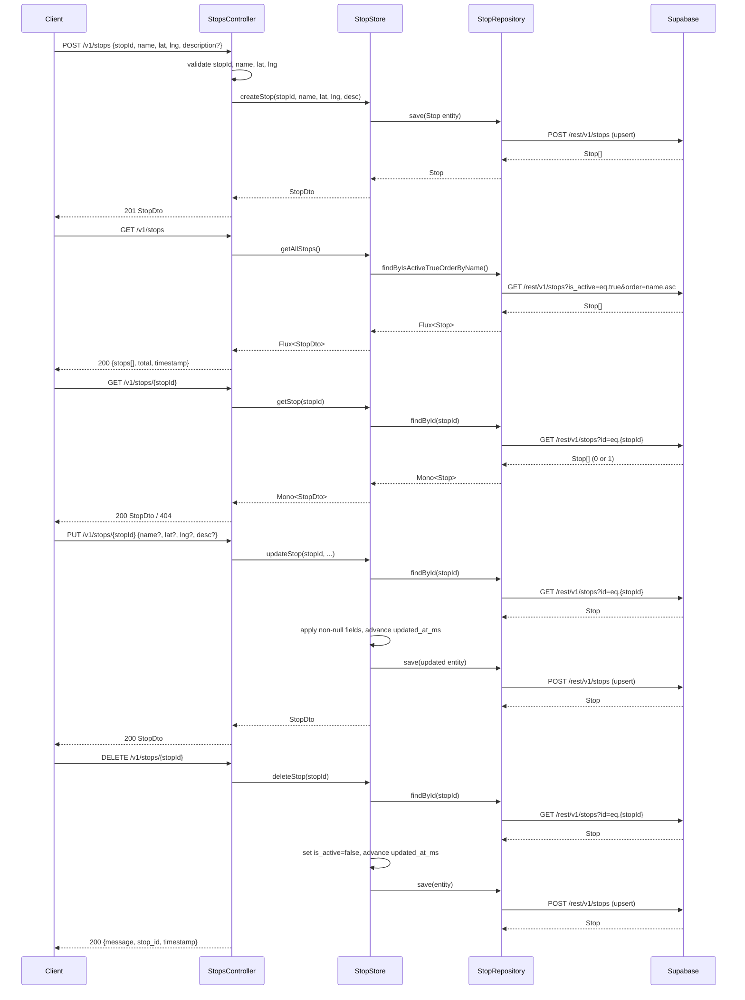

# Stops Request Flow

```mermaid
sequenceDiagram
    participant Client
    participant StopsController
    participant StopStore
    participant StopRepository
    participant Supabase

    %% CREATE
    Client->>StopsController: POST /v1/stops {stopId, name, lat, lng, description?}
    StopsController->>StopsController: validate stopId, name, lat, lng
    StopsController->>StopStore: createStop(stopId, name, lat, lng, desc)
    StopStore->>StopRepository: save(Stop entity)
    StopRepository->>Supabase: POST /rest/v1/stops (upsert)
    Supabase-->>StopRepository: Stop[]
    StopRepository-->>StopStore: Stop
    StopStore-->>StopsController: StopDto
    StopsController-->>Client: 201 StopDto

    %% GET ALL
    Client->>StopsController: GET /v1/stops
    StopsController->>StopStore: getAllStops()
    StopStore->>StopRepository: findByIsActiveTrueOrderByName()
    StopRepository->>Supabase: GET /rest/v1/stops?is_active=eq.true&order=name.asc
    Supabase-->>StopRepository: Stop[]
    StopRepository-->>StopStore: Flux<Stop>
    StopStore-->>StopsController: Flux<StopDto>
    StopsController-->>Client: 200 {stops[], total, timestamp}

    %% GET BY ID
    Client->>StopsController: GET /v1/stops/{stopId}
    StopsController->>StopStore: getStop(stopId)
    StopStore->>StopRepository: findById(stopId)
    StopRepository->>Supabase: GET /rest/v1/stops?id=eq.{stopId}
    Supabase-->>StopRepository: Stop[] (0 or 1)
    StopRepository-->>StopStore: Mono<Stop>
    StopStore-->>StopsController: Mono<StopDto>
    StopsController-->>Client: 200 StopDto / 404

    %% UPDATE
    Client->>StopsController: PUT /v1/stops/{stopId} {name?, lat?, lng?, desc?}
    StopsController->>StopStore: updateStop(stopId, ...)
    StopStore->>StopRepository: findById(stopId)
    StopRepository->>Supabase: GET /rest/v1/stops?id=eq.{stopId}
    Supabase-->>StopRepository: Stop
    StopStore->>StopStore: apply non-null fields, advance updated_at_ms
    StopStore->>StopRepository: save(updated entity)
    StopRepository->>Supabase: POST /rest/v1/stops (upsert)
    Supabase-->>StopRepository: Stop
    StopStore-->>StopsController: StopDto
    StopsController-->>Client: 200 StopDto

    %% DELETE (soft)
    Client->>StopsController: DELETE /v1/stops/{stopId}
    StopsController->>StopStore: deleteStop(stopId)
    StopStore->>StopRepository: findById(stopId)
    StopRepository->>Supabase: GET /rest/v1/stops?id=eq.{stopId}
    Supabase-->>StopRepository: Stop
    StopStore->>StopStore: set is_active=false, advance updated_at_ms
    StopStore->>StopRepository: save(entity)
    StopRepository->>Supabase: POST /rest/v1/stops (upsert)
    Supabase-->>StopRepository: Stop
    StopsController-->>Client: 200 {message, stop_id, timestamp}
```
