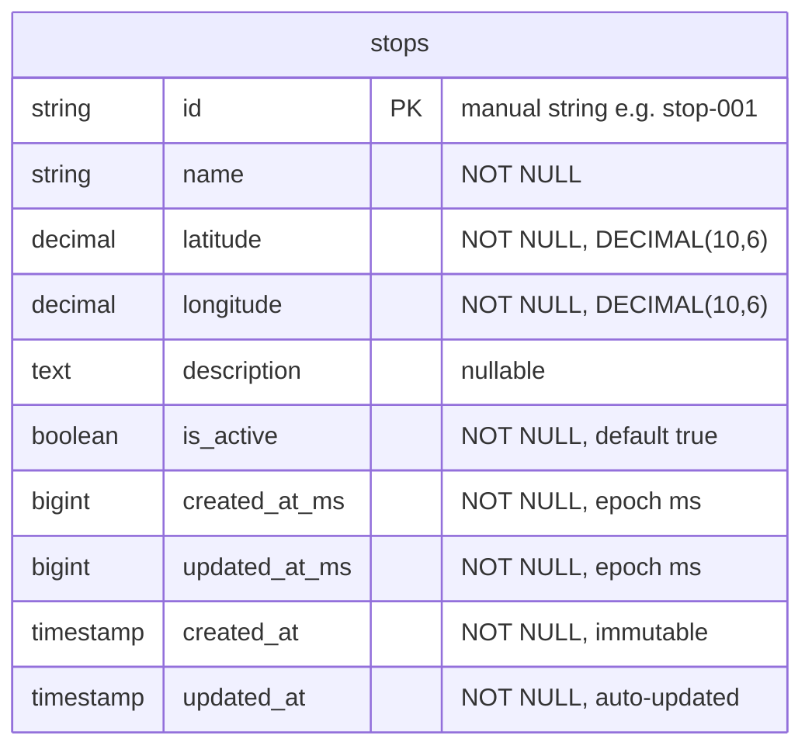

# Stops Schema

```mermaid
erDiagram
    stops {
        string id PK "manual string e.g. stop-001"
        string name "NOT NULL"
        decimal latitude "NOT NULL, DECIMAL(10,6)"
        decimal longitude "NOT NULL, DECIMAL(10,6)"
        text description "nullable"
        boolean is_active "NOT NULL, default true"
        bigint created_at_ms "NOT NULL, epoch ms"
        bigint updated_at_ms "NOT NULL, epoch ms"
        timestamp created_at "NOT NULL, immutable"
        timestamp updated_at "NOT NULL, auto-updated"
    }
```
